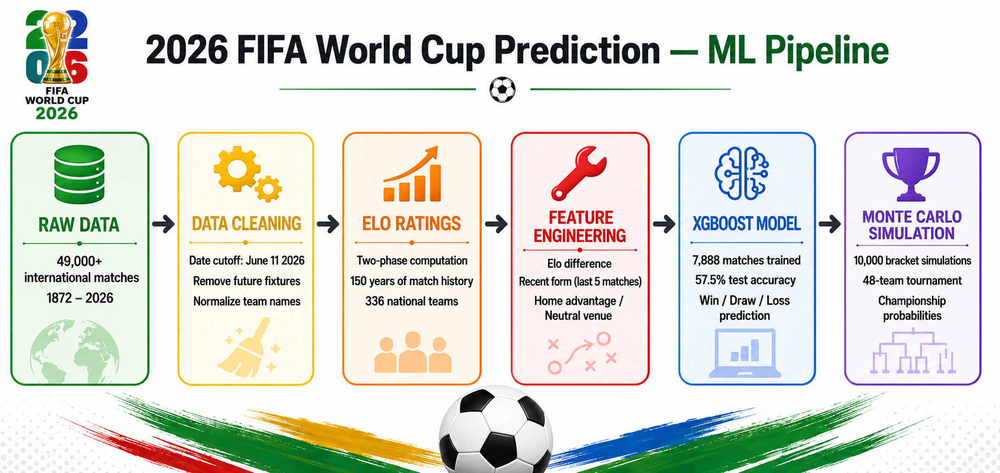
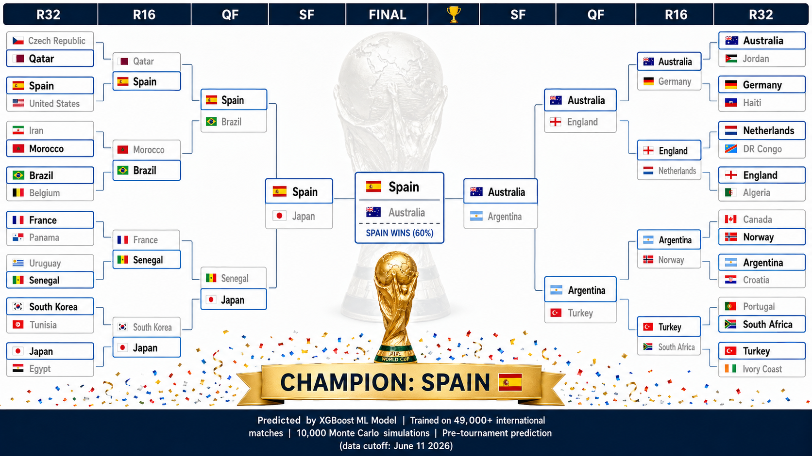
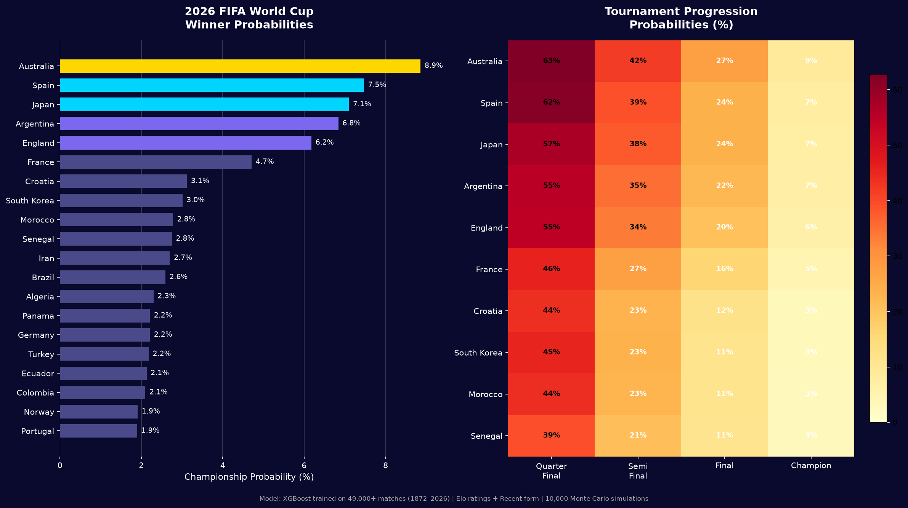

# 2026 FIFA World Cup Winner Prediction


A pre-tournament machine learning model that predicts the 2026 FIFA World Cup winner
using 150 years of international football history, Elo ratings, and 10,000 Monte Carlo
simulations of the full 48-team bracket — before a single knockout match is played.

> "The model doesn't care about reputation. It only sees data.
> Brazil sits lower than Australia because the numbers say so."

---

## Overview

Most pre-tournament predictions rely on FIFA rankings or pundit intuition.
This model builds team strength from the ground up — match by match, across
every international fixture since 1872 — and simulates the full tournament
bracket 10,000 times to produce win probabilities for all 48 teams.

| Component | Approach | Output |
|---|---|---|
| Elo Ratings | Rolling strength score updated after every match since 1872 | Pre-tournament rating per team |
| Recent Form | Win rate over last 5 matches per team | Form score 0–1 |
| XGBoost | Match outcome classifier trained on 7,888 matches (2018–2026) | Win / Draw / Loss probabilities |
| Monte Carlo | Simulate full 48-team bracket 10,000 times | Championship probability per team |



---

## The Prediction



| | Team | Note |
|---|---|---|
| 🏆 Predicted Champion | 🇪🇸 Spain | 7.47% championship probability |
| 🥈 Predicted Finalist | 🇦🇺 Australia | The model's biggest dark horse call |
| ⚡ Biggest Upset | 🇸🇳 Senegal | Predicted to knock out France in QF |

EA Sports FC ran their own simulation and also predicted Spain —
and EA has correctly predicted the last 4 World Cup winners. 👁️

---

## Dataset

**Source:** [Kaggle — International Football Results 1872–2026](https://www.kaggle.com/datasets/martj42/international-football-results-from-1872-to-2017)
**License:** CC0 Public Domain

| File | Description |
|---|---|
| `results.csv` | 49,000+ international match results (1872–2026) |
| `shootouts.csv` | Penalty shootout winners — used for knockout simulation |
| `former_names.csv` | Historical team name normalization (e.g. Zaire → DR Congo) |
| `goalscorers.csv` | Goal-level data (not used in v1) |

> Download the dataset from Kaggle and place all CSVs in the `data/` folder before running.

---

## Notebook 01 — Data & Features
`notebooks/01_data_and_features.ipynb`

Loads and cleans the full match history, computes Elo ratings chronologically,
and engineers all features used by the model.

**Data cutoff:** June 11, 2026 — the day the tournament started.
Any 2026 World Cup matches are excluded from training to prevent data leakage.

**Elo Design — Two-Phase Approach:**

Phase 1 runs the full 1872–2026 history at 30% weight to establish baseline
ratings for every nation. Phase 2 re-runs 2018 onward at full weight so recent
form drives final ratings without erasing historical context.

Tournament weights used during Elo computation:

| Tournament | Weight |
|---|---|
| FIFA World Cup | 4.0 |
| Continental Championships (Euro, Copa América, AFCON, Asian Cup) | 3.0 |
| FIFA World Cup Qualification | 2.0 |
| Other competitive | 1.0 |
| Friendly | 0.2 |

**Features engineered:**

| Feature | Description |
|---|---|
| `home_elo` / `away_elo` | Team Elo rating at time of match |
| `elo_diff` | home_elo minus away_elo |
| `home_form` / `away_form` | Win rate over last 5 matches |
| `form_diff` | home_form minus away_form |
| `home_advantage` | 1 if playing at home ground |
| `is_neutral` | 1 if neutral venue (all WC matches = 1) |

**Final pre-tournament Elo ratings (selected teams):**

| Team | Elo |
|---|---|
| 🇪🇸 Spain | 2042 |
| 🇫🇷 France | 1945 |
| 🏴󠁧󠁢󠁥󠁮󠁧󠁿 England | 1945 |
| 🇲🇦 Morocco | 1920 |
| 🇦🇷 Argentina | 1906 |
| 🇯🇵 Japan | 1904 |
| 🇦🇺 Australia | 1896 |
| 🇩🇪 Germany | 1853 |
| 🇵🇹 Portugal | 1833 |
| 🇧🇷 Brazil | 1801 |

> Brazil at 1801 and Germany at 1853 reflects genuinely inconsistent
> recent form — Brazil lost to Bolivia in WC qualification, Germany
> lost to Slovakia early in their cycle. The model is being honest,
> not broken.

---

## Notebook 02 — Model & Simulation
`notebooks/02_model_and_simulation.ipynb`

Trains the XGBoost classifier, validates on holdout data, and runs
the full Monte Carlo tournament simulation.

**Train / test split:**

| Split | Period | Matches |
|---|---|---|
| Train | 2018–2023 | 5,344 |
| Test | 2024–2026 | 2,544 |

**Model performance:**

| Metric | Value |
|---|---|
| Test Accuracy | 57.5% |
| Naive baseline (always predict home win) | ~48% |
| Beat baseline by | +9.5 percentage points |

**Feature importance:**

| Rank | Feature | Importance |
|---|---|---|
| 1 | elo_diff | 26.6% |
| 2 | form_diff | 12.5% |
| 3 | home_elo | 11.4% |
| 4 | away_elo | 11.4% |
| 5 | is_neutral | 11.1% |
| 6 | home_advantage | 10.7% |

> Elo difference is the strongest signal — team strength gap drives
> outcomes more than anything else. Venue contributes ~22% combined.

**Championship probabilities (top 10):**



---

## How to Run

### 1. Clone the repository
```bash
git clone https://github.com/aditya-ailsinghani/fifa-wc26-prediction.git
cd fifa-wc26-prediction
```

### 2. Create and activate virtual environment
```bash
python3.11 -m venv venv
source venv/bin/activate
```

### 3. Install dependencies
```bash
pip install pandas numpy xgboost scikit-learn matplotlib jupyter ipykernel
```

### 4. Register Jupyter kernel
```bash
python -m ipykernel install --user --name=fifa-wc26 --display-name "FIFA WC26"
```

### 5. Download the dataset
Download all CSVs from [Kaggle](https://www.kaggle.com/datasets/martj42/international-football-results-from-1872-to-2017)
and place them in the `data/` folder.

### 6. Run notebooks in order

| Notebook | Description |
|---|---|
| `01_data_and_features.ipynb` | Elo computation, feature engineering, save outputs |
| `02_model_and_simulation.ipynb` | Train XGBoost, Monte Carlo simulation, bracket prediction |

> Run strictly in order — Notebook 02 depends on outputs saved by Notebook 01.

---

## Project Structure

```
fifa-wc26-prediction/
├── assets/
│   └── knockouts.png                    ← predicted bracket visual
├── data/
│   ├── results.csv                      ← 49,000+ match results
│   ├── shootouts.csv                    ← penalty shootout data
│   ├── former_names.csv                 ← team name normalization
│   └── goalscorers.csv                  ← goal-level data
├── notebooks/
│   ├── 01_data_and_features.ipynb
│   └── 02_model_and_simulation.ipynb
└── outputs/
    ├── elo_ratings.json                 ← final Elo for all 336 nations
    ├── model_ready.csv                  ← 7,888 match training set
    ├── xgb_model.pkl                    ← trained XGBoost classifier
    └── wc2026_predictions.png           ← championship probability charts
```

---

## Tech Stack

| Category | Tools |
|---|---|
| ML Model | XGBoost |
| Data Processing | Pandas, NumPy |
| Simulation | Monte Carlo (custom Python) |
| Visualization | Matplotlib |
| Rating System | Custom Elo implementation |
| Environment | Python 3.11, Jupyter, Cursor |

---

## License

This project is licensed under the MIT License — see the [LICENSE](LICENSE) file for details.

---

## Connect

**Aditya Ailsinghani**

[](https://www.linkedin.com/in/aditya-ailsinghani/)
[](https://app.notion.com/p/aditya-ailsinghani/Aditya-Ailsinghani-2e314e3b3c938052b18cd37e56915cd2)
[](https://github.com/aditya-ailsinghani)
